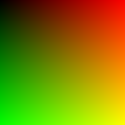
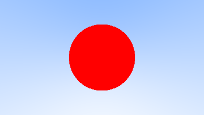
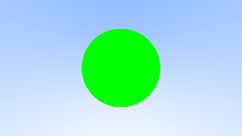

# RayTracer

This repository is my learning project for building a ray tracer in **C++**, with a goal of eventually building a **CUDA** version too.

## Output Images

Rendered gradient and scene outputs are stored in:

- `images/`

### 1) output.png

### 2) sky_gradient.png

### 3) sky_gradient_circleRed.png

### 4) sky_gradient_circleGreen.png

### 5) sky_gradient_circleCyan.png

